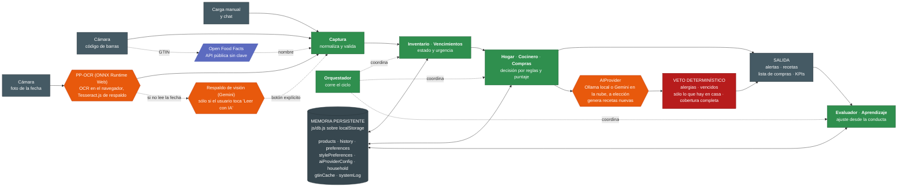
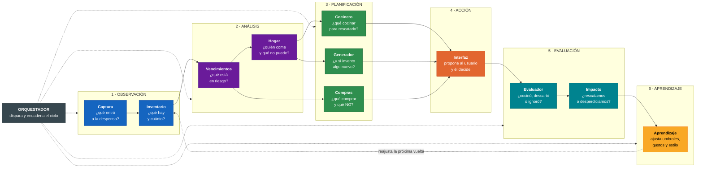
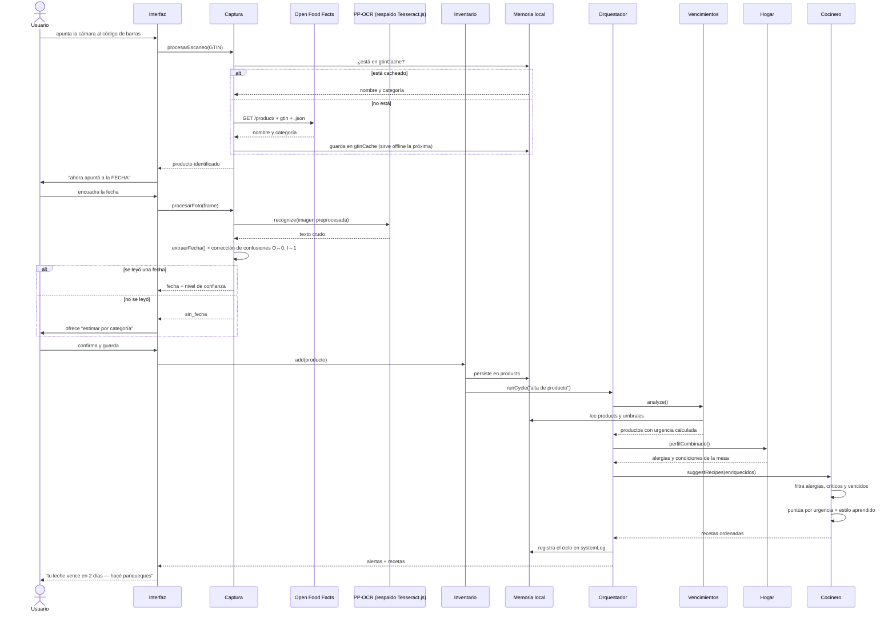
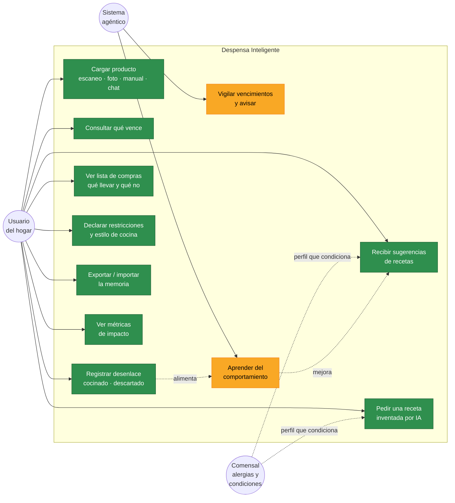
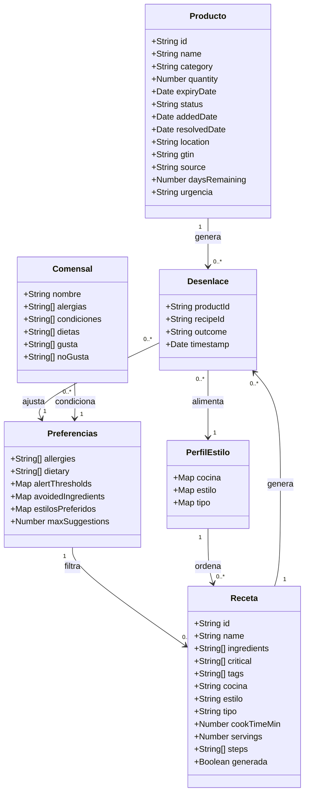

# Diagramas — Despensa Inteligente

Sección 2 de la entrega final. Los diagramas están en **Mermaid**: se
versionan como texto en el repositorio y GitHub los renderiza solo, así que
cualquier cambio en la arquitectura queda en la historia de commits.

---

## 1 · Arquitectura general del sistema

Muestra cómo fluyen los datos de entrada a salida, **qué componentes son IA
y cuáles son lógica tradicional**, y dónde vive la memoria persistente.

> **Naranja = IA. Verde = lógica determinística. Rojo = el veto.**
> Gris oscuro = memoria persistente. Azul = servicio externo.

**Lo que hay que leer en este diagrama:**

- Sólo **tres componentes son IA**: el OCR local, su respaldo de visión en
  la nube, y el generador de recetas — los tres pasan por `AIProvider`
  (texto) o comparten el mismo patrón (visión). Todo el resto de la
  inteligencia del sistema es lógica determinística. Fue una decisión, no
  una carencia: las reglas se pueden auditar y explicar, y en una app que
  maneja alergias eso importa más que la sofisticación.
- El LLM **nunca escribe directo a la salida**: pasa por el veto, que ahora
  también verifica cobertura completa (que una receta "combo" realmente
  use todos los productos que dijo usar).
- El respaldo de visión **nunca se dispara solo**: es un botón explícito
  porque manda una foto puntual a un servicio externo (Gemini) y tiene
  costo. Sin configurarlo, la app funciona entera con lo local.
- La memoria sigue siendo local. Firebase AI Logic no es un servidor
  propio: es infraestructura de Google haciendo de intermediario para no
  exponer una clave en el cliente, no un backend que el equipo opere.

---

## 2 · Flujo de agentes y ciclo de decisión

Qué decide cada agente, cómo se comunican y cuál es el ciclo.

**El ciclo es cíclico de verdad:** lo que el usuario hace en el paso 4
alimenta el aprendizaje del paso 6, que cambia los umbrales y las
prioridades con que el sistema vuelve a observar. La flecha punteada de
vuelta no es decorativa — es lo que hace que la app de la semana cuatro no
se comporte igual que la del primer día.

---

## 3 · UML — Diagrama de secuencia

Una interacción completa: el usuario escanea un producto, el sistema lo
identifica, lee la fecha con OCR y termina sugiriéndole qué cocinar.

---

## 4 · UML — Casos de uso

Los casos de uso en amarillo **no los inicia el usuario**: los dispara el
sistema por su cuenta. Es la diferencia entre una app que responde y un
sistema agéntico que además decide cuándo actuar.

---

## 5 · UML — Modelo de datos

Estructura de la memoria persistente (`js/db.js`).

`daysRemaining` y `urgencia` no se guardan: los calcula el Agente de
Vencimientos en cada ciclo. Persistir un dato derivado del reloj es pedir
que quede desactualizado.
